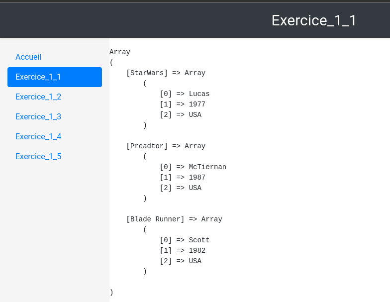
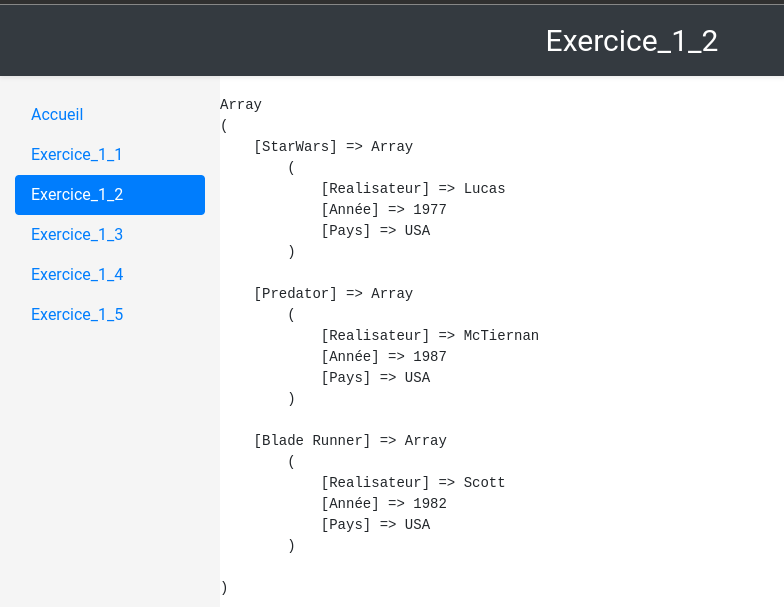
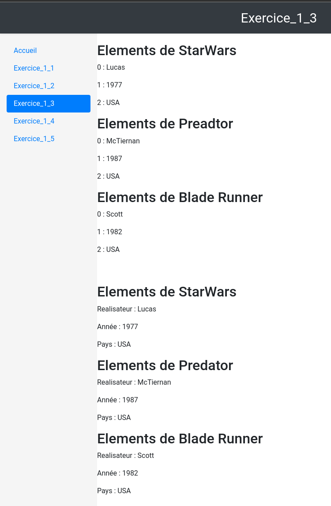
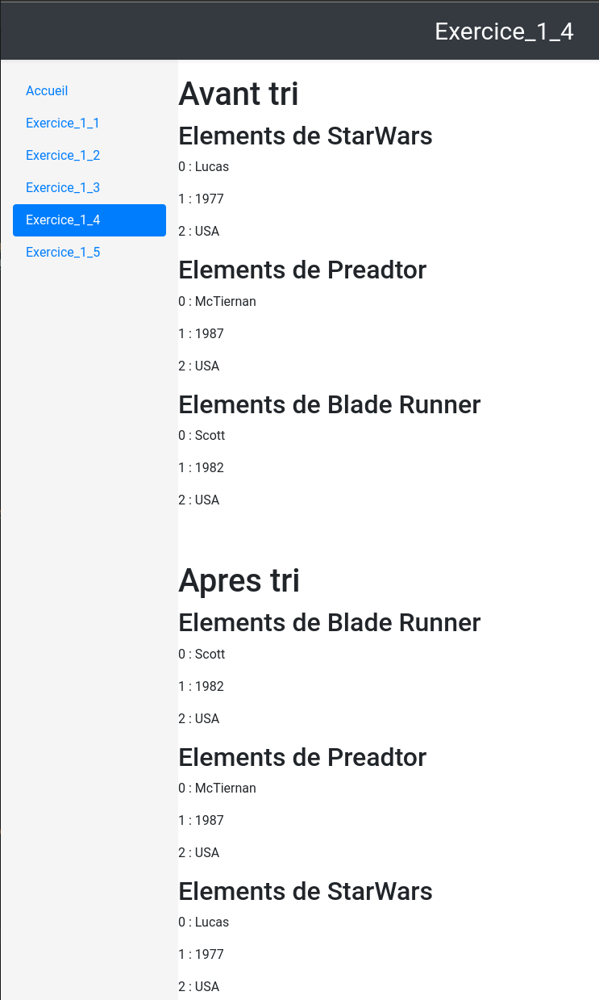
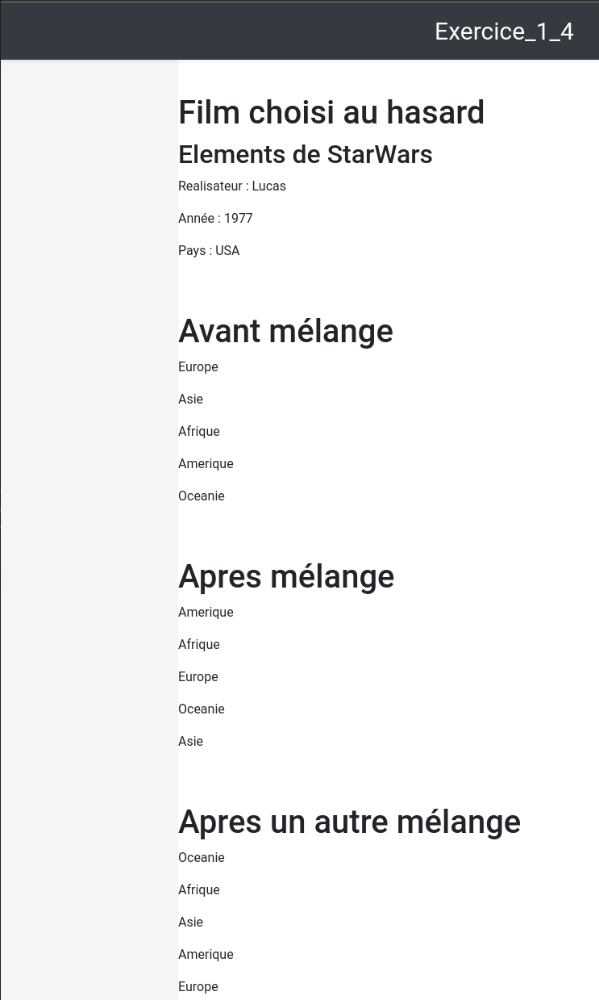
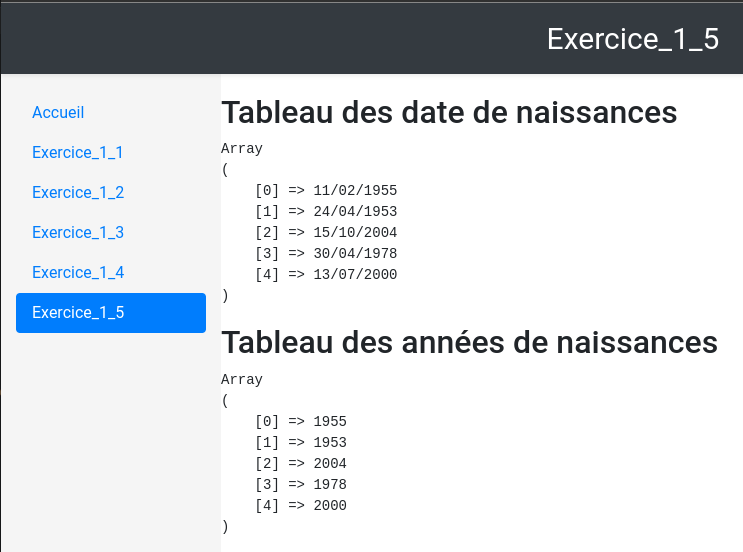

= TP2 DevWeb : Manipulation de tableaux
:toc-title: Table des matières
:toc:
:title-page:
:sectnums:
:title-logo-image: image:/Logo_IUT_Blagnac.png[]
:stem: asciimath
Emilien FIEU 3A

== Introduction

Dans ce TP, nous allons apprendre à manipuler des tableaux en PHP.

== Exercice 1 : Tableaux simples

[discrete]
=== Dans une nouvelle page (Exercice_1_1.php), définir et afficher un tableau multidimensionnel associatif dont les clés sont des noms de films et les valeurs des tableaux indicés contenant le réalisateur, le pays et l’année de sortie du film. Choisissez d’autres valeurs que celles ci-dessous. Modifier le menu du site pour pouvoir appeler cette nouvelle page (Lien « Exercice_1_1 »).

=== Code interessant

[source,php]
----
$tab = array("StarWars" => array("Lucas", 1977, "USA"),
                    "Preadtor" => array("McTiernan", 1987, "USA"),
                    "Blade Runner" => array("Scott", 1982, "USA"));
----

Dans ce code, nous déclarons un tableau associatif, dont les clés sont des noms de films et les valeurs sont des tableaux contenant le réalisateur, l'année de sortie et le pays du film.

=== Copie d’écran

== Exercice 2 : Tableaux simples

[discrete]
=== Dans une nouvelle page, définir et afficher un tableau multidimensionnel associatif dont les clés sont des noms de film et les valeurs des tableaux associatifs dont les clés sont le réalisateur, le pays et l’année de sortie du film (avec une série de valeurs associées).

=== Code interessant

[source,php]
----
$tab = array("StarWars" => array("Realisateur" => "Lucas", "Année" => 1977, "Pays" => "USA"),
    "Predator" => array("Realisateur" => "McTiernan", "Année" => 1987, "Pays" => "USA"),
   "Blade Runner" => array("Realisateur" => "Scott", "Année" => 1982, "Pays" => "USA"));
----

Dans ce code, nous déclarons un tableau associatif, dont les clés sont des noms de films et les valeurs sont des tableaux associatifs contenant le réalisateur, l'année de sortie et le pays du film.

=== Copie d’écran

== Exercice 3 : Affichages de tableaux

[discrete]
=== Dans une nouvelle page, utiliser une boucle foreach pour lire les tableaux des exercices 1_1 et 1_2 (recopiez la définition des 2 tableaux dans cette nouvelle page)

=== Code interessant

[source,php]
----
foreach ($tab as $key => $value) {
    echo "<h2>Elements de $key</h2>";
    foreach ($value as $key2 => $value2) {
        echo "
$key2 : $value2
";
    }
}
----

Dans ce code, nous utilisons une boucle foreach pour parcourir le tableau $tab. Pour chaque élément du tableau, nous affichons le nom du film, puis nous parcourons le tableau associé à ce film pour afficher les informations.

=== Copie d’écran

== Exercice 4 : Manipulation de tableaux

[discrete]
=== Dans une nouvelle page (en utilisant la documentation de PHP), trouver et tester les fonctions permettant :
- de trier les élements du tableau de l’exercice 1_1 par nom de réalisateur croissant
- de tirer un élément au hasard du tableau de l’exercice 1_2
- de mélanger les éléments d’un tableau indexé contenant les noms des continents (afrique, amerique, asie, europe, oceanie)

=== Code interessant

[source,php]
----
// Tri du tableau par nom de réalisateur
ksort($tab);

// Tirage au sort d'un film
$rand_keys = array_rand($tab, 1);

// Mélange des continents
$continents = array("Europe", "Asie", "Afrique", "Amerique", "Oceanie");
shuffle($continents);
----

Dans ce code, nous utilisons les fonctions ksort, array_rand et shuffle pour trier le tableau par nom de réalisateur, tirer un film au hasard et mélanger les continents.

=== Copie d’écran

== Exercice 5 : Manipulation de tableaux

[discrete]
=== Dans une nouvelle page, créez un tableau contenant une liste de 5 dates de naissances (format JJ/MM/AAAA, choisir des valeurs différentes de celles-cidessous). Extrayez l’année de naissance de ces données en trouvant et utilisant la bonne fonction de PHP pour l’extraction dans une chaîne de caractères. Afficherle tableau contenant la liste de ces années de naissance.

=== Code interessant

[source,php]
----
$dnt = array("11/02/1955","24/04/1953", "15/10/2004", "30/04/1978", "13/07/2000");

$annee = array();

foreach ($dnt as $value) {
    $annee[] = substr($value, 6, 4);
}
----

Dans ce code, nous déclarons un tableau contenant des dates de naissance, puis nous déclarons un tableau vide. Ensuite, nous parcourons le tableau des dates de naissance et nous extrayons l'année de naissance de chaque date. Enfin, nous ajoutons cette année au tableau vide.

=== Copie d’écran

== Conclusion

Dans ce TP, nous avons appris à créer et à manipuler des tableaux en PHP.