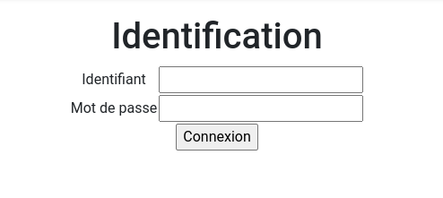
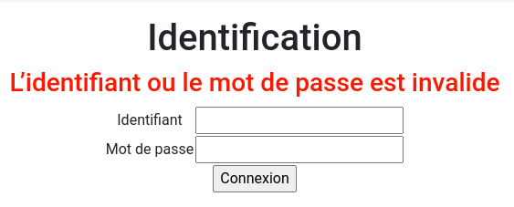
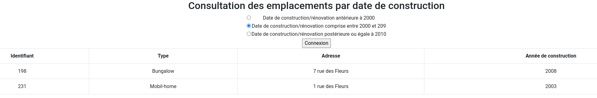
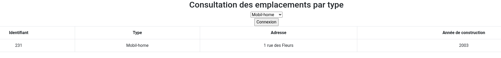

= TP3 PHP : Formulaires et Tableaux
:toc-title: Table des matières
:toc:
:title-page:
:sectnums:
:title-logo-image: image:/Logo_IUT_Blagnac.png[]
:stem: asciimath
Emilien FIEU 3A

== Introduction

Dans ce TP, nous allons apprendre à créer des formulaires en PHP et à les traiter. Ainsi que de créer et manipuler des tableaux en PHP.

== Page de connexion

Créer une page de connexion (identification.php) via un formulaire. Les bons
identifiants à saisir seront :

* Login : Joe
* Password : Biden

=== Extraits de code interessants

.identification.php
[source,php]
----
<h1>Identification</h1>
<?php
if (isset($_GET['erreur'])) {
    echo "<h3 style='color: red' '>L’identifiant ou le mot de passe est invalide</h3>";
}
?>

<form name="identification" method="post" action="index.php">
    <table>
        <tr>
            <td>Identifiant</td>
            <td><input type="text" name="identifiant" size="20"></td>
        </tr>
        <tr>
            <td>Mot de passe</td>
            <td><input type="password" name="motdepasse" size="20"></td>
        </tr>
        <tr>
            <td colspan="2" align="center"><input type="submit" name="submit" value="Connexion"></td>
        </tr>

    </table>
</form>
----
.index.php
[source,php]
----
 <?php
    if (isset($_POST['submit'])){
        $identifiant = htmlentities($_POST['identifiant']);
        $motdepasse = htmlentities($_POST['motdepasse']);
        if ($identifiant == "Joe" && $motdepasse == "Bidden"){
            echo "<h1>Bienvenue $identifiant</h1>";
        }else{
            header("Location: identification.php?erreur=1");
            exit();
        }
    } else {
        header("Location: identification.php");
        exit();
    }
?>
----

=== Captures d'écrans

.Écran de connexion

.Écran d'erreur en cas de mauvais identifiants

.Écran de bienvenue en cas de bons identifiants

== Page de Consultation des emplacements par décennie de construction

=== Création de la page InitTableaux.php

Vous devrez définir les tableaux PHP suivants dans une page InitTableaux.php :

.TabType
[format="csv",options="header"]
|===
idType, nomType
100, Bungalow
200, Mobil-Home
300, Emplacement
|===

.TabEmplacement
[format="csv",options="header"]
|===
idEmpl, idType, adresseEmpl, anneeConstruction
115, 100, 4 rue du Soleil, 2012
198, 100, 7 rue des Fleurs, 2008
231, 200, 5 rue des Fleurs, 2003
302, 300, 1 rue de la Plage, 1999
357, 300, 12 rue des Pins, 2016
|===

==== Extraits de code interessants

.InitTableaux.php
[source,php]
----
$tabType = [
    "100" => "Bungalow",
    "200" => "Mobil-home",
    "300" => "Emplacement"
];
$tabEmplacement = [
    ["idEmploi" => 100, "type" => "100", "adresse" => "4 rue du Soleil", "annee" => 2012],
    ["idEmploi" => 198, "type" => "100", "adresse" => "7 rue des Fleurs", "annee" => 2008],
    ["idEmploi" => 231, "type" => "200", "adresse" => "1 rue des Fleurs", "annee" => 2003],
    ["idEmploi" => 302, "type" => "300", "adresse" => "1 rue de la Plage", "annee" => 1999],
    ["idEmploi" => 357, "type" => "300", "adresse" => "12 rue des Pins", "annee" => 2016]
]
----

=== Création de la page ConsultDate.php

Cette page propose de consulter les emplacements selon l’année de construction/rénovation de ceux-ci. Le choix est proposé sous forme de ‘boutons radios’ :

* Date de construction/rénovation antérieure à 2000
* Date de construction/rénovation entre 2000 et 2009
* Date de construction/rénovation postérieure ou égale à 2010

Le bouton ‘Afficher’ affiche les informations suivantes, pour chaque
emplacement sélectionné :

- Id Empl
- Type de l’emplacement
- Adresse de l’emplacement
- Année de construction

==== Extraits de code interessants

.consultDate.php (Exemple de bouton radio)
[source,php]
----
 <tr>
    <td>
        <input type="radio" name="annee" value="-2000" <?php if (isset($_POST["annee"]) && $_POST["annee"] == "-2000") echo "checked"; ?>>
    </td>
    <td>Date de construction/rénovation antérieure à 2000</td>

</tr>
----

.consultDate.php (Traitement du formulaire)
[source,php]
----
if (isset($_POST["submit"])){
include ("initTableaux.php");
$annee = htmlentities($_POST["annee"]);
$tab = [];

foreach ($tabEmplacement as $emplacement){
    if ($annee == "-2000"){
        if ($emplacement["annee"] < 2000){
            $tab[] = $emplacement;
        }
    }elseif ($annee == "2000-2009"){
        if ($emplacement["annee"] >= 2000 && $emplacement["annee"] < 2010){
            $tab[] = $emplacement;
        }
    }elseif ($annee == "2010-"){
        if ($emplacement["annee"] >= 2010){
            $tab[] = $emplacement;
        }
    }
}
echo "<table class='table table-bordered'>";
echo "<tr><th>Identifiant</th><th>Type</th><th>Adresse</th><th>Année de construction</th></tr>";
foreach ($tab as $emplacement){
    echo "<tr>";
    echo "<td>".$emplacement["idEmploi"]."</td>";
    echo "<td>".$tabType[$emplacement["type"]]."</td>";
    echo "<td>".$emplacement["adresse"]."</td>";
    echo "<td>".$emplacement["annee"]."</td>";
    echo "</tr>";
}
echo "</table>";
}
----

=== Captures d'écrans

.Écran de consultation

== Page de Consultation des Emplacements par Type

[discrete]
=== Création de la page ConsultType.php

Cette page propose le choix du type des emplacements sous forme de liste déroulante (en lisant le tableau TabType) :

* Bungalow
* Mobil-Home
* Emplacement

Le bouton ‘Afficher’ affiche les informations suivantes, pour chaque emplacement sélectionné :

- Id Empl
- Type de l’emplacement
- Adresse de l’emplacement
- Année de construction

==== Extraits de code interessants

.consultType.php (Génération de la liste déroulante)
[source,php]
----
 <?php
include ("initTableaux.php");
// liste déroulante
echo "<select name='type'>";

foreach ($tabType as $typenum => $type){
    echo "<option value='$typenum'";
    if (isset($_POST["type"]) && $_POST["type"] == $typenum) echo "selected";
    echo">$type</option>";
}
?>
----

.consultType.php (Traitement du formulaire)
[source,php]
----
<?php

if (isset($_POST["submit"])){
    include ("initTableaux.php");
    $type = htmlentities($_POST["type"]);
    $tab = [];

    foreach ($tabEmplacement as $emplacement){
        if ($emplacement["type"] == $type){
            $tab[] = $emplacement;
        }
    }
    if (count($tab) == 0){
        echo "<h3 style='color: red'>Aucun emplacement de type $type</h3>";
    }else{
        echo "<table class='table table-bordered'>";
        echo "<tr><th>Identifiant</th><th>Type</th><th>Adresse</th><th>Année de construction</th></tr>";
        foreach ($tab as $emplacement){
            echo "<tr>";
            echo "<td>".$emplacement["idEmploi"]."</td>";
            echo "<td>".$tabType[$emplacement["type"]]."</td>";
            echo "<td>".$emplacement["adresse"]."</td>";
            echo "<td>".$emplacement["annee"]."</td>";
            echo "</tr>";
        }
        echo "</table>";
    }
}
?>
----

=== Captures d'écrans

.Écran de consultation

== Conclusion

Ce TP m'a permis de découvrir les formulaires en PHP et de manipuler des tableaux en PHP.