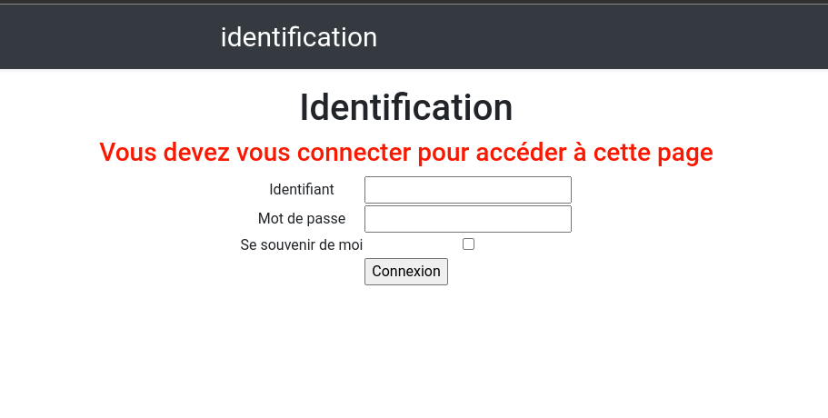
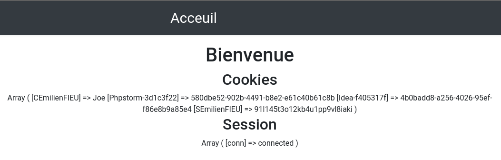
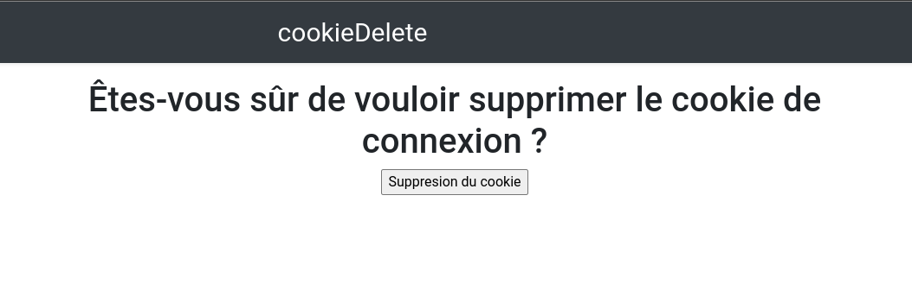
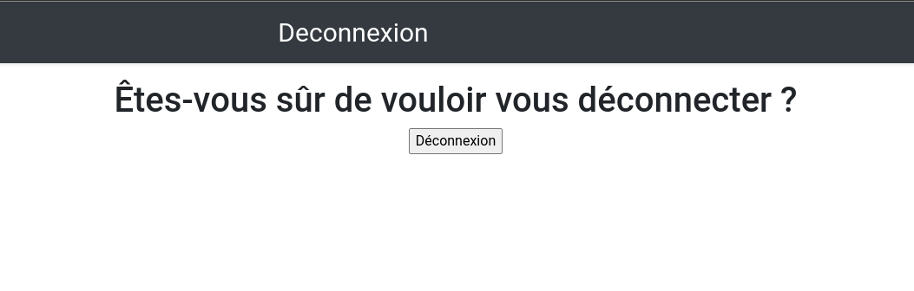
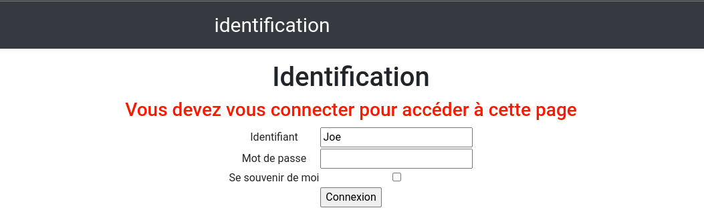

= TP4 PHP : Session et Cookie
:toc-title: Table des matières
:toc:
:title-page:
:sectnums:
:title-logo-image: image:/Logo_IUT_Blagnac.png[]
:stem: asciimath
Emilien FIEU 3A

== Introduction

Dans ce TP, nous allons voir comment utiliser les variables de session et le cookies afin de réaliser un système de connexion.

== Page de connexion

=== Capture d'écran

=== Extraits intéressants de code

.Affichage du message d’erreur
[source,php]
----
<?php
    if (isset($_GET['erreur'])) {
        switch (htmlentities($_GET['erreur'])){
        case 0:
            echo "<h3 style='color: red' '>Vous devez vous connecter pour accéder à cette page</h3>";
            break;
        case 1:
            echo "<h3 style='color: red' '>L’identifiant ou le mot de passe est invalide</h3>";
            break;
        }
    }
?>
----

.Formulaire de connexion
[source,php]
----
<form name="identification" method="post" action="traitConnexion.php">
    <table>
        <tr>
            <td>Identifiant</td>
            <td><input type="text" name="identifiant" size="20" value="<?php if (isset($_COOKIE["CEmilienFIEU"])) {echo $_COOKIE["CEmilienFIEU"];}?>"></td>
        </tr>
        <tr>
            <td>Mot de passe</td>
            <td><input type="password" name="motdepasse" size="20"></td>
        </tr>

        <tr>
            <td>Se souvenir de moi</td>
            <td><input type="checkbox" name="souvenir" value="oui"></td>
        </tr>

        <tr>
            <td colspan="2" align="center"><input type="submit" name="submit" value="Connexion"></td>
        </tr>

    </table>
</form>
----

== Traitement de la connexion

=== Extraits intéressants de code

.Vérification des identifiants et mot de passe puis création de la session et éventuellement du cookie. Redirection vers la page adaptée.
[source,php]
----
<?php
    if (isset($_POST['submit'])){
        $identifiant = htmlentities($_POST['identifiant']);
        $motdepasse = htmlentities($_POST['motdepasse']);
        if ($identifiant == "Joe" && $motdepasse == "Bidden"){

            if (isset($_POST['souvenir'])){
                setcookie("CEmilienFIEU", $identifiant, time() + 60*15);
            }

            session_name("SEmilienFIEU");
            session_start();
            $_SESSION['conn'] = "connected";
            header("Location: index.php");
            exit();

        }else{
            header("Location: identification.php?erreur=1");
            exit();
        }
    } else {
        header("Location: identification.php?erreur=0");
        exit();
    }
?>
----

== Page d'accueil

=== Capture d'écran

=== Extraits intéressants de code

.Vérification de la connexion et affichage des informations de session et de cookie, si l'utilisateur est connecté. Sinon, redirection vers la page de connexion.
[source, php]
----
if ((isset($_SESSION['conn']) and htmlentities($_SESSION['conn']) == 'connected') or (isset($_COOKIE['CEmilienFIEU']) and htmlentities($_COOKIE['CEmilienFIEU']) == "connected")){

        if (!isset($_SESSION['conn'])){
            $_SESSION['conn'] = "connected";
        }

        echo "<h1>Bienvenue</h1>";

        // Affichage des cookies

        echo "<h2>Cookies</h2>";
        print_r($_COOKIE);

        // Affichage de la variable de session

        echo "<h2>Session</h2>";
        print_r($_SESSION);
} else {
    echo $_SESSION['conn'];
    header("Location: identification.php?erreur=0");
    exit();
}
----

== Suppression du cookie

=== Capture d'écran

=== Extraits intéressants de code

.Suppression du cookie
[source,php]
----
<?php
if (isset($_POST['submit'])){

    if (isset($_COOKIE['CEmilienFIEU'])){
        unset($_COOKIE['CEmilienFIEU']);
        setcookie("CEmilienFIEU", null, -1);
    }
}

header("Location: index.php");
exit();
?>
----

== Déconnexion

=== Capture d'écran

=== Extraits intéressants de code

.Suppression de la variable de session
[source,php]
----
<?php
if (isset($_POST['submit'])){
    session_name("SEmilienFIEU");
    session_start();
    session_destroy();

}

header("Location: index.php");
exit();
?>
----

== Afficheage du nom en cas de déconnexion avec cookie

=== Capture d'écran

== Conclusion

Dans ce TP, nous avons appris à manipuler les variables de session et les cookies afin de réaliser un système de connexion. Nous avons également vu comment utiliser les variables de session et les cookies pour stocker des informations sur l'utilisateur.