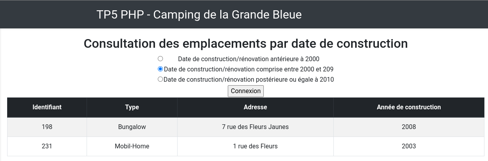
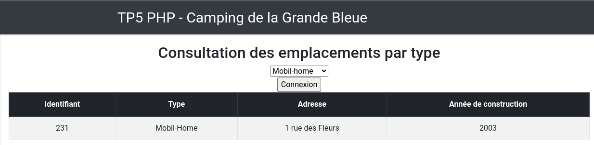

= TP5 DevWeb : MySQL et PDO
:toc-title: Table des matières
:toc:
:title-page:
:sectnums:
:title-logo-image: image:/Logo_IUT_Blagnac.png[]
:stem: asciimath
Emilien FIEU 3A

== Introduction

Dans ce TP, nous allons apprendre à utiliser MySQL avec PHP. Nous allons utiliser PDO pour nous connecter à la base de données.

== Création de la base de données Camping

[source,sql]
----
include::CreaBaseCampingAtrous.sql[]
----

== Modifier les pages existantes

=== Renommer le titre du header.php en « TP5 PHP - Camping de la Grande Bleue »

==== Capture d’écran

.Titre de la page

=== Enlever l’affichage des sessions et cookies existants de la page index.php et ajoutez-y le message « Bienvenue dans notre Camping de la Grande Bleue ! ».

==== Capture d’écran

=== Créer le script connect.inc.php

==== Code source

[source,php]
----
<?php
include 'include/identifiants.php'; // Je versionne mes TP avec Github donc pour eviter de donner mes identifiants, je les stocke dans un fichier non versionné

$hostname = 'localhost';
$database = 'my67';

try {
    // Create a new PDO instance
    $pdo = new PDO("mysql:host=$hostname;dbname=$database", $username, $password);

    // Set PDO error mode to exception for better error handling
    $pdo->setAttribute(PDO::ATTR_ERRMODE, PDO::ERRMODE_EXCEPTION);

} catch (PDOException $e) {
    // Handle any errors that occur during database connection
    die("Error: " . $e->getMessage());
}
?>
----

=== Modifiez ConsultDate.php

==== Capture d’écran

==== Code source

.Extrait de Consult date qui récupère les données de la base de données et les affiche selon ce qui est demandé dans le formulaire
[source,php]
----

if (isset($_POST["submit"])){
    include 'connect.inc.php';
    $annee = htmlentities($_POST["annee"]);
    $tab = [];

    $tabType = [];

    $sql = "SELECT * FROM `Type`";

    try {
        // Prepare the SQL query
        $stmt = $pdo->prepare($sql);

        // Execute the statement
        $stmt->execute();

        $temptab = $stmt->fetchAll(PDO::FETCH_ASSOC);

        // Get the result set
        foreach ($temptab as $type){
            $tabType[$type["idType"]] = $type["nomType"];
        }

    } catch (PDOException $e) {
        // Handle any errors
        die("Error: " . $e->getMessage());
    }

    if ($annee == "-2000"){
        $sql = "SELECT * FROM `Emplacement` WHERE `anneeConstruction` < 2000";
    }elseif ($annee == "2000-2009"){
        $sql = "SELECT * FROM `Emplacement` WHERE `anneeConstruction` >= 2000 AND `anneeConstruction` < 2010";
    }elseif ($annee == "2010-"){
        $sql = "SELECT * FROM `Emplacement` WHERE `anneeConstruction` >= 2010";
    }

    try {
        // Prepare the SQL query
        $stmt = $pdo->prepare($sql);

        // Execute the statement
        $stmt->execute();

        // Get the result set
        $tab = $stmt->fetchAll(PDO::FETCH_ASSOC);

    } catch (PDOException $e) {
        // Handle any errors
        die("Error: " . $e->getMessage());
    }

    echo "<table class='table table-bordered table-striped'>";
    echo "<thead class='thead-dark'>";
    echo "<tr><th>Identifiant</th><th>Type</th><th>Adresse</th><th>Année de construction</th></tr>";
    echo "</thead>";
    foreach ($tab as $emplacement){

        echo "<tr>";
        echo "<td>".$emplacement["idEmpl"]."</td>";
        echo "<td>".$tabType[$emplacement["idType"]]."</td>";
        echo "<td>".$emplacement["adresseEmpl"]."</td>";
        echo "<td>".$emplacement["anneeConstruction"]."</td>";
        echo "</tr>";
    }
    echo "</table>";
}
----

=== Modifiez ConsultType.php

==== Capture d’écran

==== Code source

.Extrait de Consult type qui récupère les données de la base de données et les affiche selon ce qui est demandé dans le formulaire
[source,php]
----
include ("connect.inc.php");

if (isset($_POST["submit"])){

    $type = htmlentities($_POST["type"]);
    $tab = [];

    $tabType = [];

    $sql = "SELECT * FROM `Type`";

    try {
        // Prepare the SQL query
        $stmt = $pdo->prepare($sql);

        // Execute the statement
        $stmt->execute();

        $temptab = $stmt->fetchAll(PDO::FETCH_ASSOC);

        // Get the result set
        foreach ($temptab as $type){
            $tabType[$type["idType"]] = $type["nomType"];
        }

    } catch (PDOException $e) {
        // Handle any errors
        die("Error: " . $e->getMessage());
    }

    $sql = "SELECT * FROM Emplacement WHERE idType = '$_POST[type]'";

    try {
        // Prepare the SQL query
        $stmt = $pdo->prepare($sql);

        // Execute the statement
        $stmt->execute();

        // Get the result set
        $tab = $stmt->fetchAll(PDO::FETCH_ASSOC);

    } catch (PDOException $e) {
        // Handle any errors
        die("Error: " . $e->getMessage());
    }

    if (count($tab) == 0){
        echo "<h3 style='color: red'>Aucun emplacement de type $type</h3>";
    }else{
        echo "<table class='table table-bordered table-striped'>";
        echo "<thead class='thead-dark'>";
        echo "<tr><th>Identifiant</th><th>Type</th><th>Adresse</th><th>Année de construction</th></tr>";
        echo "</thead>";
        foreach ($tab as $emplacement){
            echo "<tr>";
            echo "<td>".$emplacement["idEmpl"]."</td>";
            echo "<td>".$tabType[$emplacement["idType"]]."</td>";
            echo "<td>".$emplacement["adresseEmpl"]."</td>";
            echo "<td>".$emplacement["anneeConstruction"]."</td>";
            echo "</tr>";
        }
        echo "</table>";
    }
}
----

== Conclusion

Ce TP m'a permis de découvrir PDO et de l'utiliser pour me connecter à une base de données MySQL. J'ai pu apprendre à faire des requêtes SQL et à les utiliser dans mon code PHP.