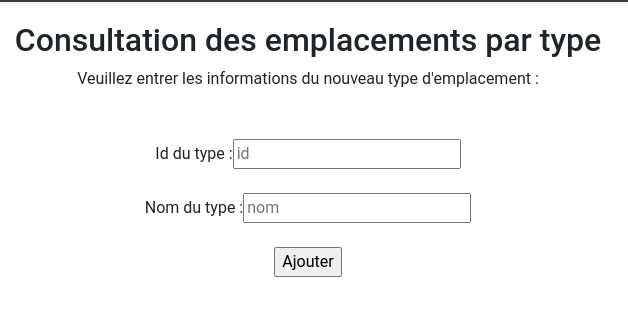
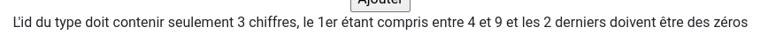
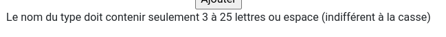
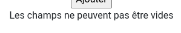

= TP6 PWS REGEX et PDO : Développement Web
:toc-title: Table des matières
:toc:
:title-page:
:sectnums:
:title-logo-image: image:/Logo_IUT_Blagnac.png[]
:stem: asciimath
Emilien FIEU 3A

== Introduction

Dans ce TP, nous allons manipuler de nouveau PDO et nous allons découvrir les expressions régulières.

== Modification de ConsultDate.php et ConsultType.php

=== ConsultDate.php

==== Sauvegarde du choix de la date

[source,php]
----
<form name="consultDate" method="post" action="consultDate.php">
    <table>
        <tr>
            <td>

                <input type="radio" name="annee" value="-2000" <?php if (isset($_POST["annee"]) && $_POST["annee"] == "-2000") echo "checked"; ?>>
            </td>
            <td>Date de construction/rénovation antérieure à 2000</td>

        </tr>
        <tr>
            <td>
                <input type="radio" name="annee" value="2000-2009" <?php if (isset($_POST["annee"]) && $_POST["annee"] == "2000-2009") echo "checked"; ?>>
            </td>
            <td>Date de construction/rénovation comprise entre 2000 et 209</td>
        </tr>
        <tr>
            <td>
                <input type="radio" name="annee" value="2010-" <?php if (isset($_POST["annee"]) && $_POST["annee"] == "2010-") echo "checked"; ?>>
            </td>
            <td>Date de construction/rénovation postérieure ou égale à 2010</td>
        </tr>
        <tr>
            <td colspan="2" align="center"><input type="submit"  name="submit" value="Connexion"></td>
        </tr>
    </table>
</form>
----

=== ConsultType.php

==== Sauvegarde du choix du type d’empalcement

[source,php]
----
foreach ($tabType as $typenum => $type){
                    echo "<option value='$typenum'";
                    if (isset($_POST["type"]) && $_POST["type"] == $typenum) echo "selected";
                    echo">$type</option>";
                }
----

==== Affichage d’un message d’erreur si le type d’emplacement n’a pas d’enregistrements

[source,php]
----
if (count($tab) == 0){
                echo "<h3 style='color: red'>Aucun emplacement de type $tabType[$type]</h3>";
            }
----

== Création de la page AjoutType.php

=== Formulaire

[source,html]
----
<form name="ajoutType" method="post" action="ajoutType.php">
    Veuillez entrer les informations du nouveau type d'emplacement :
         

    Id du type :<input type="text" name="id" placeholder="id">
       
    Nom du type :<input type="text" name="nom" placeholder="nom">
       
    <input type="submit" name="submit" value="Ajouter">

</form>
----

.Formulaire d'ajout d'un type d'emplacement

=== Ajout du type dans la base de données

[source,php]
----
if (isset($_POST['submit'])){
$idType = htmlentities($_POST['id']);
$nomType = htmlentities($_POST['nom']);

if (empty($idType) or empty($nomType)){
    echo "Les champs ne peuvent pas être vides";
    exit();
}

if (preg_match("/^[4-9][0]{2}$/", $idType)){
    if (preg_match("/^[a-zA-Z ]{3,25}$/", $nomType)) {

        $id = htmlentities($_POST['id']);
        $nom = htmlentities($_POST['nom']);
        $sql = "INSERT INTO Type VALUES ('$id', '$nom')";
        try {
            // Prepare the SQL query
            $stmt = $pdo->prepare($sql);

            // Execute the statement
            $stmt->execute();

            header("Location: consultType.php");

        } catch (PDOException $e) {
            // Handle any errors
            die("Error: " . $e->getMessage());
        }
    } else {
        echo "Le nom du type doit contenir seulement 3 à 25 lettres ou espace (indifférent à la casse)";
    }
} else {
    echo "L'id du type doit contenir seulement 3 chiffres, le 1er étant compris entre 4 et 9 et les 2 derniers doivent être des zéros";
}

}
----

==== Affichages

.Id du type invalide

.Nom du type invalide

.Champs vides

== Conclusion

Ce TP m'a permis de découvrir les expressions régulières et de les utiliser dans un formulaire. Ainsi que de plus manipuler PDO.##